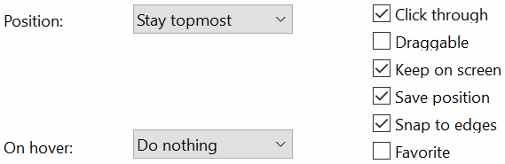

# \[Rainmeter\] Brightness

Brightness is a widget made for [Rainmeter](https://www.rainmeter.net/) on Windows.  
It uses the freeware utility [ControlMyMonitor](https://www.nirsoft.net/utils/control_my_monitor.html) made by [Nir Sofer](https://www.nirsoft.net/about_nirsoft_freeware.html) to allow monitor brightness control (external dependency to download separatly).

It comes with 2 widgets:

- **Brightness:** the brightness control widget
- **MonitorOverlay:** an optional overlay to dim a DDC/CI incompatible display, or further dim an overly bright monitor

---

## Usage:

The *Brightness* widget is a simple square indicating the current brightness level:

Hover over it to display four clickable percentages:

For more precise control, use the mouse wheel to change the brightness in 5% steps:

Click the square indicating the current brightness level to activate "Movie Mode," which dims all your displays except the main one to 0%:

Click again to exit this mode.

---

## Installation:

You obviously need to install **Rainmeter** first.

**Brightness:**

- Download and install the **Brightness.rmskin** by double-clicking it  

> If you prefer to install it manually, download the widget files to **Documents/Rainmeter/Skins/Brightness**.  
> And install the **SysColor.dll** plugin made by *Brian Ferguson* from his GitHub repository: [brianferguson/SysColor.dll](https://github.com/brianferguson/SysColor.dll/)

- The widget uses the command-line options provided by the [ControlMyMonitor](https://www.nirsoft.net/utils/control_my_monitor.html) freeware, developed by [NirSoft](https://www.nirsoft.net/about_nirsoft_freeware.html)

> [Download](https://www.nirsoft.net/utils/controlmymonitor.zip) the application from the NirSoft website.  
> Unzip the three files to **Documents/Rainmeter/Skins/Brightness/ControlMyMonitor**.

- Consider making a small [donation](https://www.nirsoft.net/donate.html) to *Nir Sofer*, as this widget would not exist without his work ;-)

&nbsp;
&nbsp;

**MonitorOverlay:**

- Download and install the **MonitorOverlay.rmskin** by double-clicking it  

> If you prefer to install it manually, download the MonitorOverlay.ini file to **Documents/Rainmeter/Skins/MonitorOverlay**.

> :warning: **DO NOT LOAD THE OVERLAY MANUALLY THROUGH RAINMETER** as it would result in a **100% opaque black box**

---

## Configuration:

**Brightness** settings are stored in the **Settings.inc** file, located in the **Documents/Rainmeter/Skins/Brightness/@Resources** directory.

Open it with a text editor and modify:

- **BgAlpha=** widget background transparency (0 = 100% transparent, 255 = 100% opaque)
- **MonitorX_Name=** your monitor's unique identifier string for ControlMyMonitor commands. *Monitor1_Name* will be the one not diming in "movie mode"

> Open ControlMyMonitor by double-clicking **Documents/Rainmeter/Skins/Brightness/ControlMyMonitor/ControlMyMonitor.exe**.  
> Follow the [ControlMyMonitor](https://www.nirsoft.net/utils/control_my_monitor.html) instructions:  
>> If you have multiple monitors, you have to find a string that uniquely identifies your monitor. Open ControlMyMonitor, select the desired monitor and then press Ctrl+M (Copy Monitor Settings). Paste the string from the clipboard into notepad or other text editor. You'll see something like this:  
>> Monitor Device Name: "\\.\DISPLAY1\Monitor0"  
>> Monitor Name: "22EA53"  
>> Serial Number: "402CFEZE1200"  
>> Adapter Name: "Intel(R) HD Graphics"  
>> Monitor ID: "MONITOR\GSM59A4\{4d36e96e-e325-11ce-bfc1-08002be10318}\0012"  
>> Short Monitor ID: GSM59A4  
>> You can use any string from this list as long as the other monitors on your system have different values for the same property

- **MonitorX_MaxBrightness=** limits the maximum brightness allowed for each of your monitors (in percent).

> To match your 600 nits primary monitor to that of your 300 nits secondary monitor, write 50 to Monitor1_MaxBrightness.  

- **Overlay_Enabled=** set this value to 1 to use the MonitorOverlay widget
- **Overlay_LinearAlpha=** set this value to 1 if you prefer a linear variation in the MonitorOverlay's opacity rather than a gradual change (slow change at high brightness, faster at low brightness).
- **Overlay_Threshold=** below what brightness do you want to enable the MonitorOverlay?
- **Overlay_MaxAlpha=** maximum opacity of the MonitorOverlay. The closer the value is to 0, the greater the transparency

> :warning: Keep it relatively low if you don't want a completely black display (Overlay_MaxAlpha = 255) at 0% brightness.  
> The overlay cannot change the backlight level of your monitor and will decrease the contrast ratio.

- Load the widget variant that matches your number of DDC/CI compatible monitors

&nbsp;
&nbsp;

To configure **MonitorOverlay**, open **MonitorOverlay.ini** in the **Documents/Rainmeter/Skins/MonitorOverlay/** directory.

Edit the last line **Shape=**:

- **Rectangle 0,0,1920,1080:** replace *1920, 1080* with the resolution of the monitor you want to use the overlay on
- **Fill Color 0,0,0:** color of the overlay (*red, green, blue*), black by default. You can tweak this color slightly to achieve a *low blue light* tint at night for example
- On the Brightness widget, with *Overlay_Enabled=1* (see above), select a brightness level below *Overlay_Threshold* to make the overlay visible

- Move it to the desired monitor and use the following options inside Rainmeter:

---

## Credits and Third-Party Licenses:

**Widget:** Licensed under GNU GPLv3 by HellPC

**SysColor.dll:** Licensed under GNU GPLv2 or later (GPLv2+) by Brian Ferguson

**ControlMyMonitor:** Distributed as Freeware by NirSoft (External dependency, not included in this package)
